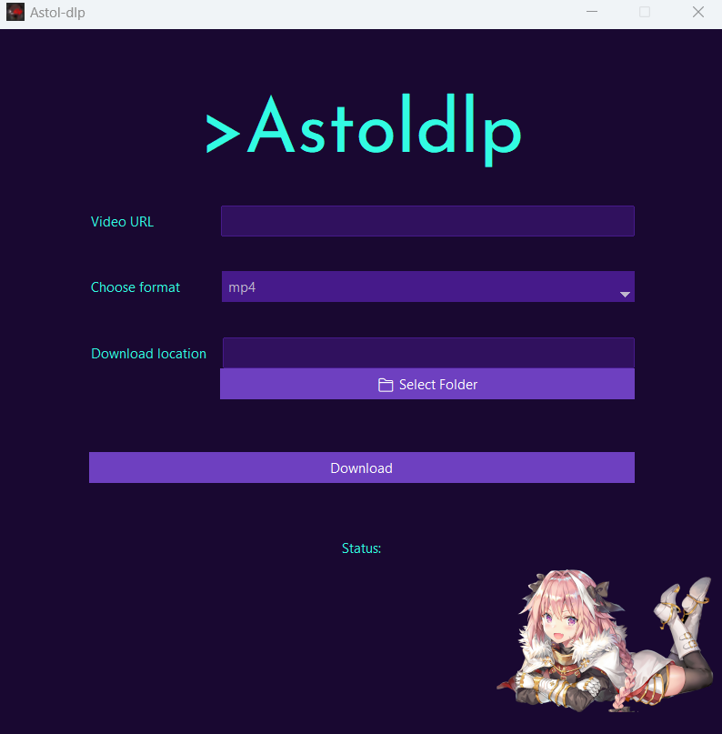

# Astol-dlp ⬇️
A simple youtube downloader ([yt-dlp](https://github.com/yt-dlp/yt-dlp) frontend) that I created for myself

## Installation for windows
You can use the prebuilt binary [here](https://github.com/TheXploler/Resources/releases/latest)

## Installation for other platforms
```bash
    pip install -r requirements.txt
```

## Screenshots


<sub>No, I don't like Astolfo, shut up </sub>
